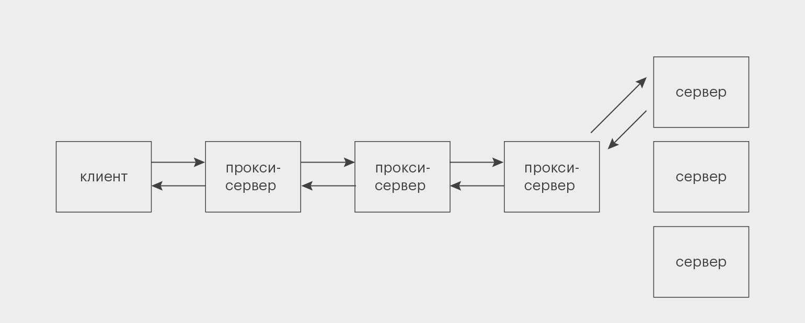
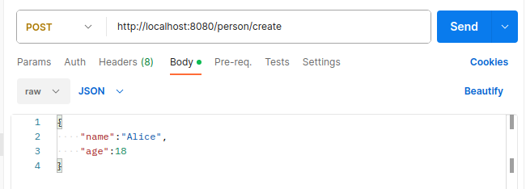
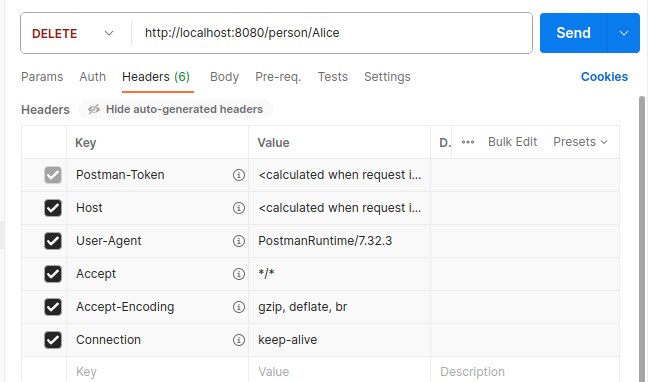
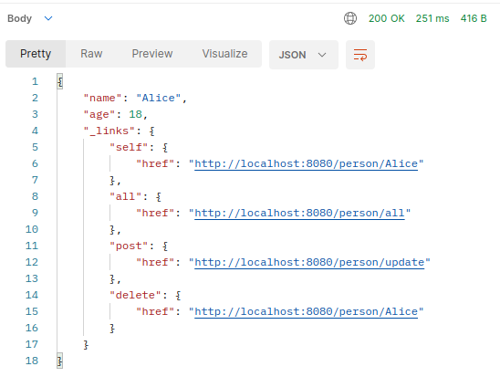

# Что такое REST API

**REST API** — это архитектурный подход, который устанавливает ограничения 
для API: как они должны быть устроены и какие функции поддерживать. 
Это позволяет стандартизировать работу программных интерфейсов, сделать 
их более удобными и производительными.

Слово **REST** — акроним от Representational State Transfer, что 
переводится на русский как «передача состояния представления», 
«передача репрезентативного состояния» или «передача „самоописываемого“
состояния».

В отличие от, например, SOAP API, REST API — не протокол, а простой 
список рекомендаций, которым можно следовать или не следовать. Поэтому
у него нет собственных методов. С другой стороны, его автор Рой Филдинг
создал ещё и протокол HTTP, так что они очень хорошо сочетаются, 
и REST обычно используют в связке с HTTP. Хотя новичкам нужно помнить:
**REST — это не только HTTP, а HTTP — не только REST.**

---

# Как работает REST API: 6 принципов архитектуры

Всего в REST есть шесть требований к проектированию API. 
Пять из них обязательные, одно — опциональное:

* Клиент-серверная модель (client-server model).
* Отсутствие состояния (statelessness).
* Кэширование (cacheability).
* Единообразие интерфейса (uniform interface).
* Многоуровневая система (layered system).
* Код по требованию (code on demand) — необязательно.

Чтобы разобраться в них подробнее, нужно понимать, что в вебе называют
ресурсами. **Ресурсы** — это любые данные:текст, изображение, видео,
аудио, целая программа. Например, HTML веб-страницы.

---

## Клиент-серверная модель

Это требование отделяет друг от друга два понятия: клиент и сервер.

**Сервер** — программа, в которой хранятся и обрабатываются ресурсы. 
Сервер может располагаться на одном или нескольких компьютерах; 
но даже в одном компьютере может быть несколько виртуальных серверов.

**Клиент** — программа, которая запрашивает у сервера доступ к ресурсам.
Для этого она использует API. 

Получается структура, при которой клиент направляет к серверу запрос,
а в ответ получает ресурсы. Такое разделение позволяет создавать клиент
и сервер независимо друг от друга, что ускоряет и упрощает разработку.

## Отсутствие состояния

Второй принцип настолько важен, что даже отражён в названии архитектурного 
стиля — **Representational State Transfer**. Это значит, что на сервере не
хранится никаких данных о прошлых взаимодействиях с клиентом — каждый запрос
должен содержать всю информацию для его обработки.

Например, кто-то запросил последнее сообщение от ООО «Рога и копыта». В 
этом запросе содержится вся информация, которая нужна серверу, чтобы 
дать корректный ответ.

Если клиент потом хочет получить предпоследнее сообщение, то он не может
просто сказать: «Дай мне соседний ресурс» — ему нужно заново составить
полный запрос по всем правилам.

Это снижает нагрузку на сервер, что особенно полезно, если к нему подключено
одновременно много клиентов. Не нужно хранить дополнительную информацию о
прошлых обращениях каждого из них. Достаточно обработать каждый запрос в
отдельности.

    Даже если какой-то из предыдущих запросов потеряется, это не сломает логику
    взаимодействия клиента и сервера, потому что каждый запрос самодостаточен.

## Кэширование

Иногда клиент запрашивает с сервера одни и те же данные по несколько раз — 
например, вы постоянно обращаетесь к какому-нибудь важному письму в сервисе
для учёта деловых переписок.

Если при каждом таком запросе сервер будет с нуля собирать нужные данные
и отправлять их клиенту, нагрузка на систему повысится — особенно когда
таких повторов много. Решением проблемы в REST API стало **кэширование**,
то есть сохранение части данных у клиента или на промежуточных серверах.

Однако тут тоже важно подойти к делу без излишнего фанатизма и не
кэшировать всю информацию подряд. Во-первых, для этого потребовались бы
слишком большие объёмы памяти. Во-вторых, какие-то данные (скажем,
количество исходящих писем) со временем могут устаревать — зачем же
держать этот неактуальный хлам в кэше? Именно поэтому в каждом ответе 
сервера на запрос есть пометка о том, можно ли его кэшировать.

## Многоуровневая система

До сих пор мы рассматривали сервер как единую сущность. Но его структура
куда сложнее. Между ним и клиентом есть несколько промежуточных узлов,
выполняющих вспомогательные функции, — прокси-серверы.

Они используются для кэширования, обеспечения безопасности, дополнительной
обработки данных. Если основных серверов несколько, то дополнительные
серверы-балансировщики могут распределять нагрузку между ними и решать,
в какой из них направлять запрос:

Никто из участников цепочки не знает всего пути, который проходит запрос,
— только своих «соседей» справа и слева. Ни клиент, ни один из
прокси-серверов не знает, к кому он обращается — к основному сервису или
к другому прокси. В REST API это работает в обе стороны: никакие 
серверы (ни основные, ни прокси) не знают, кому отправляют ответ и уходит
ли он куда-то дальше.

## Код по требованию (необязательно)

Этот принцип означает, что сервер в ответ на запрос может отправить 
исходный код, который выполняется уже на стороне клиента. Благодаря 
этому можно передавать целые сценарии. Например, динамические элементы 
пользовательского интерфейса, написанные на JavaScript.

В REST API требование необязательно, потому что не всем сайтам и
сервисам нужно умение работать с готовыми скриптами.

---

# Методы

Как правило, для взаимодействия между клиентом и сервером достаточно четырех методов:

* GET — получение информации об объекте (ресурсе);
* POST — создание, а иногда и изменение объекта (ресурса);
* PUT — изменение объекта (ресурса). Обычно используется для регулярного обновления данных;
* DELETE — удаление информации об объекте (ресурсе).
    
Реже используются методы LIST, UPDATE, PATCH и др.

---

# Структура запроса

Запрос REST API от клиента к серверу всегда состоит из следующих элементов:

* Конечная точка (endpoint) — адрес, по которому отправляется запрос.
* Параметры — делятся на параметры пути и параметры запроса.
* Заголовки (headers) — в заголовках определяется формат передаваемых данных, 
спецификация и версия протокола обмена и другая информация, необходимая для 
корректной обработки запроса.
* Тело запроса (body) — данные для обработки, как правило в формате JSON.

# Структура ответа

После выполнения REST API запроса сервер вернет клиентскому приложению
ответ. Он включает код ответа, заголовки и тело ответа.

* Как и в запросе, заголовки в ответе также определяют формат передаваемых 
данных, спецификацию и версию протокола обмена, и другие сведения, которые
помогут клиентскому приложению правильно прочитать и понять ответ.
* Тело ответа — это информация, которую запрашивал клиент. Ответ тоже
чаще всего передается в формате JSON. Но тело ответа может быть и пустым.
* Код ответа — это признак успешности выполнения запроса. Для унификации 
используются стандартные коды ответа. Они представляют собой трехзначные
числа. Ответы, начинающиеся с цифры 1, обозначаются 1xx, и т.п.

    На картинке показан пример ответа на запрос POST

Ответы вида 1хх — информационные.

Ответы вида 2хх говорят об успешном выполнении запроса. Например:

* 200 OK — успешный запрос. Если клиентом были запрошены какие-либо
    данные, то они находятся в заголовке и/или теле сообщения. Появился в HTTP/1.0. 
* 201 Created — в результате успешного выполнения запроса был создан новый ресурс.
* 202 Accepted — запрос был принят на обработку, но она не завершена. Клиенту
не обязательно дожидаться окончательной передачи сообщения, так как может быть 
начат очень долгий процесс.

Ответы вида 3xx обозначают перенаправление или необходимость уточнения.
Например:

* 300 Multiple Choices — по указанному URI существует несколько вариантов 
предоставления ресурса по типу MIME, по языку или по другим характеристикам.
Сервер передаёт с сообщением список альтернатив, давая возможность сделать 
выбор клиенту автоматически или пользователю.
* 301 Moved Permanently — запрошенный документ был окончательно перенесен на
новый URI, указанный в поле Location заголовка. Некоторые клиенты некорректно 
ведут себя при обработке данного кода.

Ответы вида 4хх говорят о том, что при выполнении запроса возникла ошибка 
на стороне клиента. Например:

* 400 Bad Request — сервер обнаружил в запросе клиента синтаксическую ошибку.
* 401 Unauthorized — для доступа к запрашиваемому ресурсу требуется аутентификация.
* 403 Forbidden — сервер понял запрос, но он отказывается его выполнять из-за
ограничений в доступе для клиента к указанному ресурсу.
* 404 Not Found — самая распространённая ошибка при пользовании Интернетом,
основная причина — ошибка в написании адреса Web-страницы

Ответы вида 5хх говорят об ошибке на стороне сервера. Например:

*  500 Internal Server Error — любая внутренняя ошибка сервера, 
которая не входит в рамки остальных ошибок класса.
*  503 Service Unavailable — сервер временно не имеет возможности обрабатывать 
запросы по техническим причинам (обслуживание, перегрузка и прочее).
* 504 Gateway Timeout — сервер в роли шлюза или прокси-сервера не дождался 
ответа от вышестоящего сервера для завершения текущего запроса.

---

# Альтернативы и применение REST API

REST API — самый популярный сегодня стандарт взаимодействия приложений, 
хотя не первый и не единственный.

Первым широко распространенным стандартом стал SOAP (Simple Object Access Protocol).
Но SOAP-сообщения довольно громоздки (как минимум потому, что используют формат XML,
а не более лаконичный JSON), что стало особенно неудобно с распространением мобильного
интернета. SOAP изначально предназначался для описания вызова удаленных процедур — 
RPC (Remote Procedure Call), когда клиентское приложение выполняет функцию или 
процедуру на сервере, а сервер отправляет результат обратно клиенту.

Современная реализация этого подхода — gRPC, на ней реализованы API сервисов
Yandex Cloud. С их помощью вы можете создавать приложения и сервисы, использующие
ресурсы Yandex Cloud.

